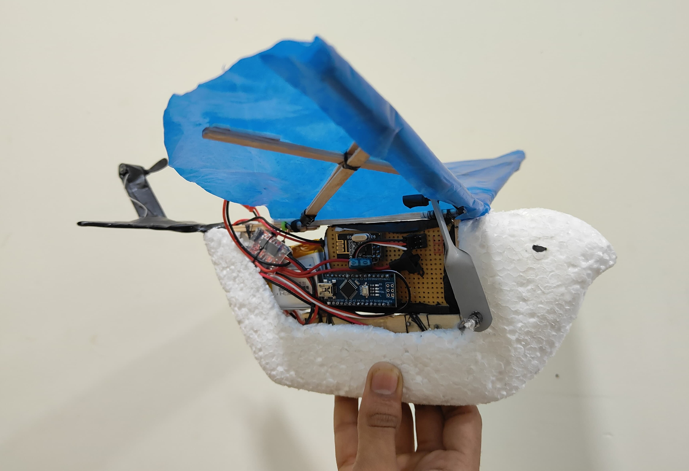
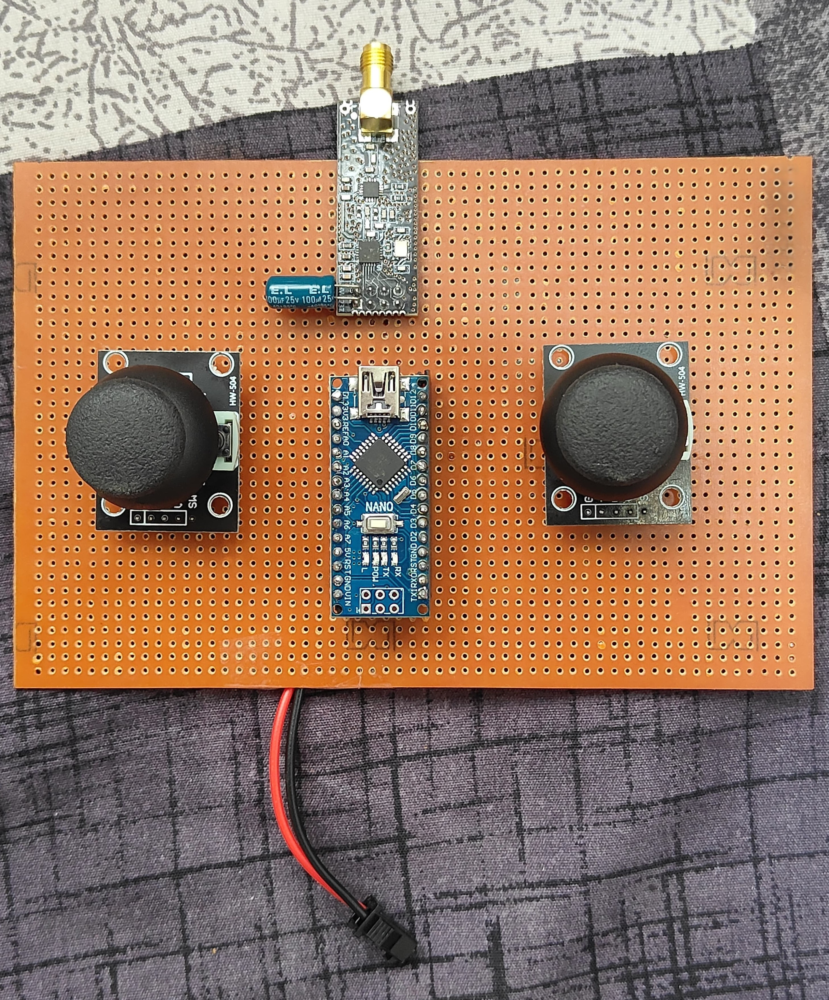

# 🐦🕹️ Ornithopter with Custom Made Controller

A bio-inspired flying robot designed to replicate flapping-wing flight dynamics using a custom-built wireless transmitter-receiver system. This project serves as a foundational step toward developing a Ornithopter with Spy-Camera — a bird-like flying robot — aimed at military surveillance, aerial reconnaissance, and advanced remote-control experimentation.

<p align="center">
  
</p>

Inspired by the natural flight of birds, the system features a custom-designed controller and a dual-motor mechanism: one motor for wing flapping using a gear system, and another for directional control. Although flight was not fully achieved in this phase, the wing flapping and control architecture successfully demonstrate the core mechanical and communication principles for future enhancements.

---

# ➤ Project Vision

The idea is to eventually integrate a Spy-camera into the ornithopter, enabling aerial surveillance — especially useful for defense and intelligence purposes.

This prototype demonstrates:

- Wing flapping mechanism
- Custom controller design

---

# ➤ Key Features

- Bird-like structure and motion
- Wing flapping-mechanism using gear-driven motor
- Direction control using mini coreless tail motor
- Wireless communication using nRF24L01 modules
- Custom-made handheld controller using joysticks

---

# ➤ Hardware Used (Summary)

This project uses:

- 2 Arduino Nano boards one for transmitter, one for receiver
- 2 nRF24L01 modules for wireless communication
- Mini coreless motors for wing flapping and tail direction control
- Gear mechanism to replicate flapping action
- Joysticks for user input and control
- Li-Po battery as the main power source

<p align="center">
  
</p>

For detailed schematics and wiring references, please check the **Schematic_Pictures/** folder.

---

# 📁 Repository Structure

```text
Ornithopter-with-Custom-Controller/

├── Code/
│   ├── transmitter_code.ino
│   └── receiver_code.ino
│
├── Images/
│   ├── Controller_Unit/
│   │   ├── transmitter_controller.jpg
│   │   └── receiver_module.jpg
│   │
│   └── Ornithopter/
│       ├── front_view.jpg
│       ├── side_view.jpg
│       ├── top_view.jpg
│       └── ornithopter.jpg
│
├── Schematic_Pictures/
│   ├── Circuit_Diagrams/
│   │   ├── transmitter_circuit_diagram.jpg
│   │   └── receiver_circuit_diagram.jpg
│   │
│   └── Wiring_Images/
│       ├── transmitter_wiring.jpg
│       └── receiver_wiring.jpg
│
├── Videos/
│   ├── bird_structure_testing.mp4
│   └── ornithopter_mechanism_demo.mp4
│
├── LICENSE
└── README.md
```

---

# ➤ How It Works

- **Transmitter:** Reads joystick values (throttle, yaw, pitch, roll) and transmits data via nRF24L01.
- **Receiver:** Decodes incoming signals and drives motors using PWM signals.
- **Wing Mechanism:** Driven by a geared motor to mimic flapping.
- **Tail Motor:** Rotates based on joystick yaw value to simulate turning.

---

# 📸 Sneak Peek

🎥 Visit the **Videos/** folder for real demo clips of the flapping mechanism in action.

---

# ➤ Future Enhancements

Our ornithopter serves as a foundation for future upgrades, such as:

- Integrating a micro camera for FPV (First-Person View) and surveillance applications
- Optimizing weight to achieve stable real-time flight
- Adding onboard sensors like a gyroscope or accelerometer for improved flight stability
- Implementing autonomous or semi-autonomous flight using microcontrollers and basic AI logic

---

# ➤ Inspiration & Purpose

This project was inspired by the desire to recreate bird-like flapping flight through human-made systems. It lays the foundation for a bird-like, bio-inspired aerial platform designed for future use in military surveillance scenarios. By focusing initially on the fundamentals of flapping motion and control, this system aspires to evolve into a stealthy reconnaissance tool capable of discreet intelligence gathering.

---

# 🙌 Acknowledgements

This project was inspired by a variety of educational resources and online tutorials. I would also like to acknowledge the effort put into applying my own ideas, logic, and hands-on experimentation throughout the development process.
