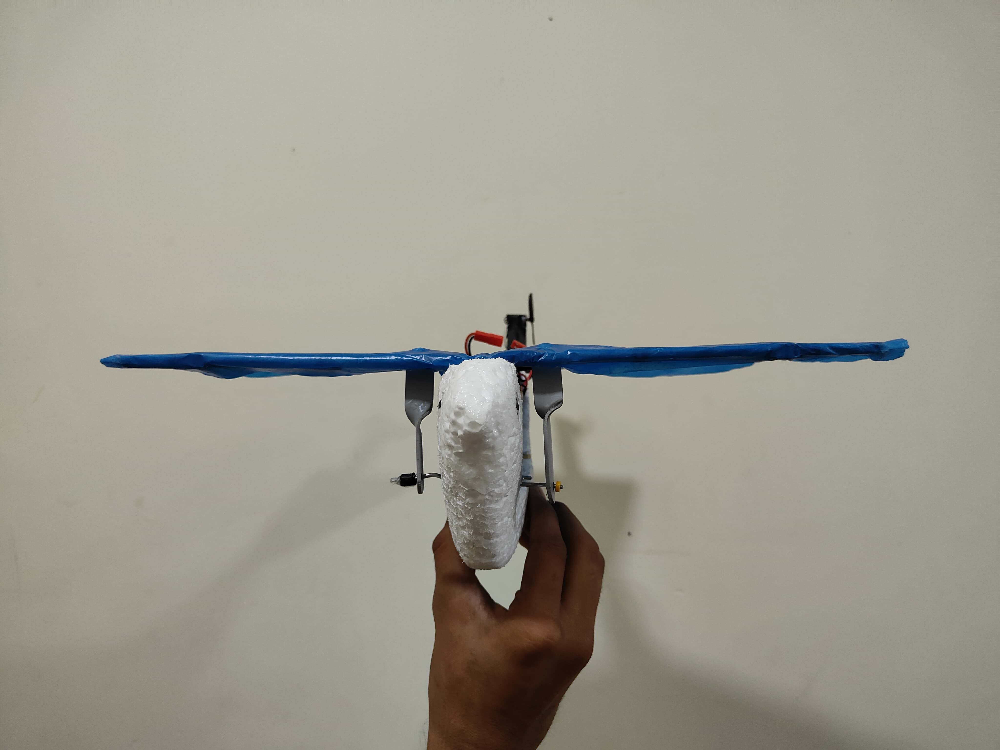
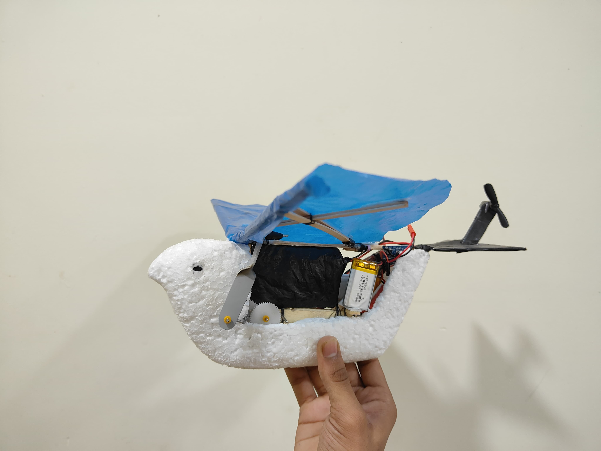
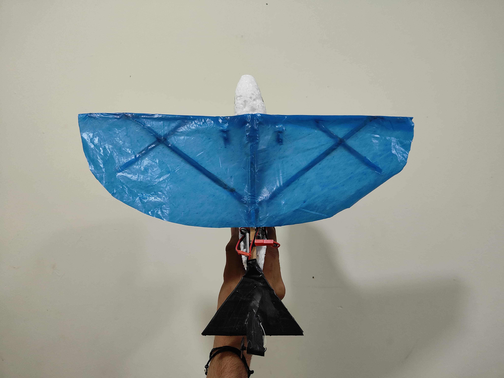
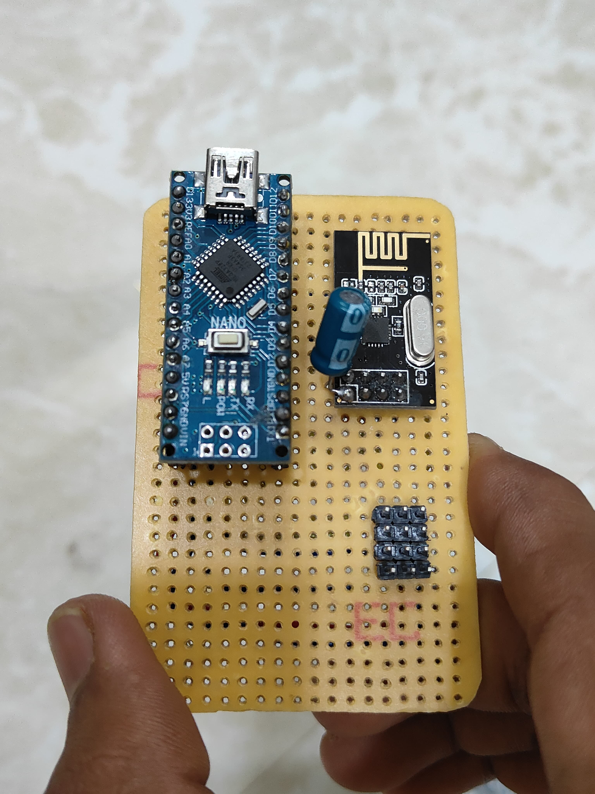

# 🐦🕹️ Ornithopter with Custom Made Controller

A bio-inspired ornithopter prototype developed to mimic the flapping flight of birds using a custom-built wireless transmitter and receiver system. This project combines embedded systems, wireless communication, and mechanical wing actuation to demonstrate the fundamentals of flapping-wing flight control.

<p align="center">
  
</p>

Inspired by bird flight, this prototype uses a custom handheld controller to wirelessly operate an ornithopter. A geared motor drives the wing-flapping mechanism, while a separate motor controls directional movement. Although this version is a prototype, it successfully demonstrates the communication, control, and mechanical principles required for future development.

---

# ➤ Project Vision

The goal of this project is to develop a lightweight bio-inspired flying robot capable of carrying small payloads such as cameras or sensors for aerial monitoring and research.

This prototype demonstrates:

- Wing flapping mechanism
- Wireless transmitter and receiver communication
- Custom-built handheld controller

---

# ➤ Key Features

- Bird-inspired mechanical design
- Flapping-wing mechanism driven by a geared motor
- Wireless communication using nRF24L01 modules
- Direction control using a coreless DC motor
- Custom joystick-based transmitter
- Arduino Nano based control system

---

# ➤ Hardware Used (Summary)

This project uses:

- 2 × Arduino Nano boards (Transmitter & Receiver)
- 2 × nRF24L01 wireless modules
- Geared DC motor for wing flapping
- Coreless DC motor for tail control
- Two-axis joystick modules
- Li-Po battery
- Motor driver circuitry
- Custom-built controller PCB

<p align="center">
  
</p>

For complete circuit diagrams and wiring details, refer to the **Schematic_Pictures/** folder.

---

# 📁 Repository Structure

```
ornithopter-with-custom-controller/
│
├── Code/
│   ├── transmitter_code.ino
│   └── receiver_code.ino
│
├── Images/
│   ├── Controller_Unit/
│   └── Ornithopter/
│
├── Schematic_Pictures/
│   ├── Circuit_Diagrams/
│   └── Wiring_Images/
│
├── Videos/
│
├── LICENSE
└── README.md
```

---

# ➤ How It Works

**Transmitter**

- Reads joystick positions
- Converts user inputs into control data
- Sends data wirelessly through the nRF24L01 module

**Receiver**

- Receives wireless data
- Processes commands using Arduino Nano
- Controls the wing motor and tail motor

**Wing Mechanism**

- Geared DC motor generates the flapping motion.

**Tail Mechanism**

- Coreless motor changes the tail direction to assist steering.

---

# 📸 Project Images

### Ornithopter

<p align="center">
  
  
  
</p>

### Controller Unit

<p align="center">
  
  
</p>

---

# 🎥 Demo Video

Visit the **Videos/** folder to watch the working demonstration of the ornithopter prototype.

---

# ➤ Future Enhancements

Future improvements include:

- Integrating an onboard FPV camera
- Reducing overall weight
- Improving wing efficiency
- Adding IMU sensors for stabilization
- GPS-assisted navigation
- Autonomous flight control
- AI-based flight optimization

---

# ➤ Inspiration

This project was inspired by the remarkable flight of birds and the concept of flapping-wing aerial robots. It provided practical experience in embedded systems, wireless communication, motor control, and mechanical design while laying the groundwork for future ornithopter development.

---

# 🙌 Acknowledgements

I would like to thank my faculty members, project mentors, and the open-source electronics community for their valuable resources and guidance. This project also reflects extensive hands-on experimentation and continuous learning throughout the development process.

---

## 📜 License

This project is licensed under the MIT License.
